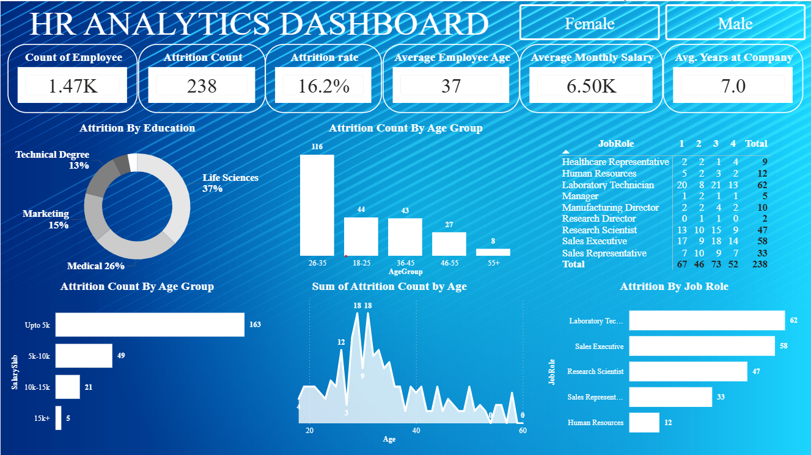

# HR Analytics Dashboard

This Power BI dashboard provides a comprehensive overview of employee attrition and workforce metrics, including employee count, attrition rate, average age, salary distribution, years at company, and attrition analysis by education, age group, salary slab, and job role. It is designed to help HR teams identify trends, understand employee turnover patterns, and support data-driven decision-making.

## Dashboard Preview

